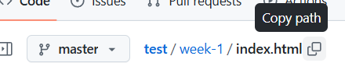

# HIT15-WEB-PRIVATE-2024 - WEEK 1

---

## Nội dung

### [I. Cài đặt IDE, Extensions](#i-cài-đặt-ide-extensions)

[1. IDE](#1-ide-visual-studio-code)
[2. Extensions](#2-extensions)

### [II. Git & Github](#ii-git--github)

[1. Git](#1-git)
[2. Github](#2-github)

### [III. HTML, CSS & Javascript](#iii-html-css--javascript)

[1. HTML](#1-html)
[2. CSS](#2-css)
[3. Javascript](#3-javascript)

---

## I. Cài đặt IDE, Extensions

### 1. IDE

[Visual Studio Code](https://code.visualstudio.com/Download)

### 2. Extensions

- [HTML CSS Support](https://marketplace.visualstudio.com/items?itemName=ecmel.vscode-html-css)
- [Live server](https://marketplace.visualstudio.com/items?itemName=ritwickdey.LiveServer)
- [Auto Close Tag](https://marketplace.visualstudio.com/items?itemName=formulahendry.auto-close-tag)
- [Auto Rename Tag](https://marketplace.visualstudio.com/items?itemName=formulahendry.auto-rename-tag)

## II. Git & Github

### 1. Git

a. Git là gì?
Git là hệ thống quản lý phiên bản phân tán (VCS - Version Control System), giúp bạn theo dõi mọi thay đổi trong mã nguồn của dự án, từ đó có thể hợp và làm việc nhóm một cách dễ dàng và hiệu quả

b. Tại sao cần dùng Git

- Theo dõi sự thay đổi của dự án
- Dễ dàng quay lại phiên bản trước đó nếu có lỗi
- Hỗ trợ làm việc nhóm nhiều người trên cùng 1 dự án

c. Khái niệm cơ bản

- Repo (Repository): kho lưu trữ mã nguồn, nơi chứa toàn bộ các file và lịch sử thay đổi của dự án
  - Local repo: Đây là repo được thiết lập trên máy của lập trình viên và dành cho 1 người sử dụng
  - Remote repo: Đây là repo để chia sẽ giữa nhiều người và bố trí trên server chuyên dụng
    
- Branch: Tương tự như một workspace mới mà không ảnh hưởng tới nhánh chính
- Commit: là hành động ghi lại sự thay đổi trong repo của bạn
- Clone: là hành động tải một bản sao có sẵn của một remote repo server nào đó có sẵn
- Push: là hành động đưa các commit từ local repo lên remote repo

d. Cài đặt và cấu hình

1. [Download Git](https://git-scm.com/downloads?ref=blog.haposoft.com)
2. Thiết lập thông tin cá nhân trên git
   ```git
   git config --global user.name "Tên của bạn"
   git config --global user.email "email@example.com"
   ```
   
3. Khởi tạo git
   ```git
   git init
   ```
   
4. Kiểm tra trạng thái
   ```git
   git status
   ```
   
5. Thêm file vào vùng lưu trữ tạm (staging area)
   ```git
   git add <file>
   git add .
   ```
   
6. Commit
   ```git
   git commit -m "Mô tả đặt ở đây"
   ```
   
7. Xem lịch sử commit
   ```git
   git log
   ```
   

### 2. Github

a. Github là gì?
Github là nền tảng lưu trữ mã nguồn online, cho phép lập trình viên lưu trữ, chia sẻ và làm việc trên cùng một repo
b. Liên kết Git và Github

1. Tạo github và khởi tạo repo
   

   

   

2. Liên kết với Github

   ```git
   git remote add origin <link repo>
   ```

   

   ```git
   git remote -v
   ```

   

3. Đẩy mã nguồn lên Github

   ```git
   git push -u origin master
   ```

   

4. Github Page

   - Vào Settings
     
   - Vào Pages
     
     
     

     và "Save"

   - Đợi 1 lát và load lại trang
     
     Nhấn "Visit site"
   - Quay lại thư mục chứa file .html và copy path
     
   - Quay lại Github pages, paste vào đường link + enter
     
     

## III. HTML, CSS & Javascript

### 1. HTML

- HTML (HyperText Markup Language) là ngôn ngữ đánh dấu được sử dụng để tạo cấu trúc và nội dung cho một trang web.
- HTML không phải là ngôn ngữ lập trình mà là ngôn ngữ đánh dấu để sắp xếp các thành phần như văn bản, hình ảnh, liên kết, biểu mẫu, và các nội dung khác trên trang web.

### 2. CSS

- CSS (Cascading Style Sheets) là ngôn ngữ dùng để mô tả cách hiển thị của các phần tử HTML trên trang web.
- Nó quyết định về bố cục, màu sắc, kiểu chữ, kích thước, khoảng cách giữa các phần tử, v.v. CSS giúp trang web trông trực quan và dễ nhìn hơn.

### 3. Javascript

- JavaScript là ngôn ngữ lập trình cho phép tương tác và xử lý các hành vi động trên trang web. Với JavaScript, bạn có thể tạo ra các tính năng như xử lý sự kiện, thay đổi nội dung của trang, kiểm tra dữ liệu đầu vào của người dùng, và nhiều hơn nữa.
- JavaScript làm cho trang web trở nên tương tác, sinh động và thân thiện với người dùng hơn.
